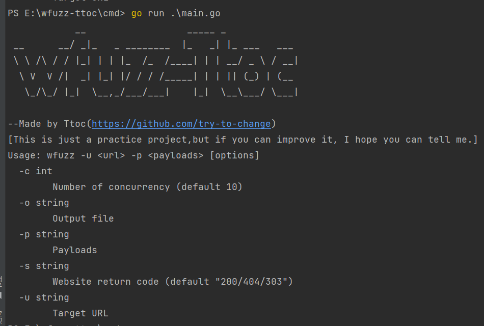
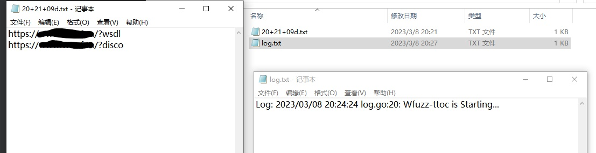
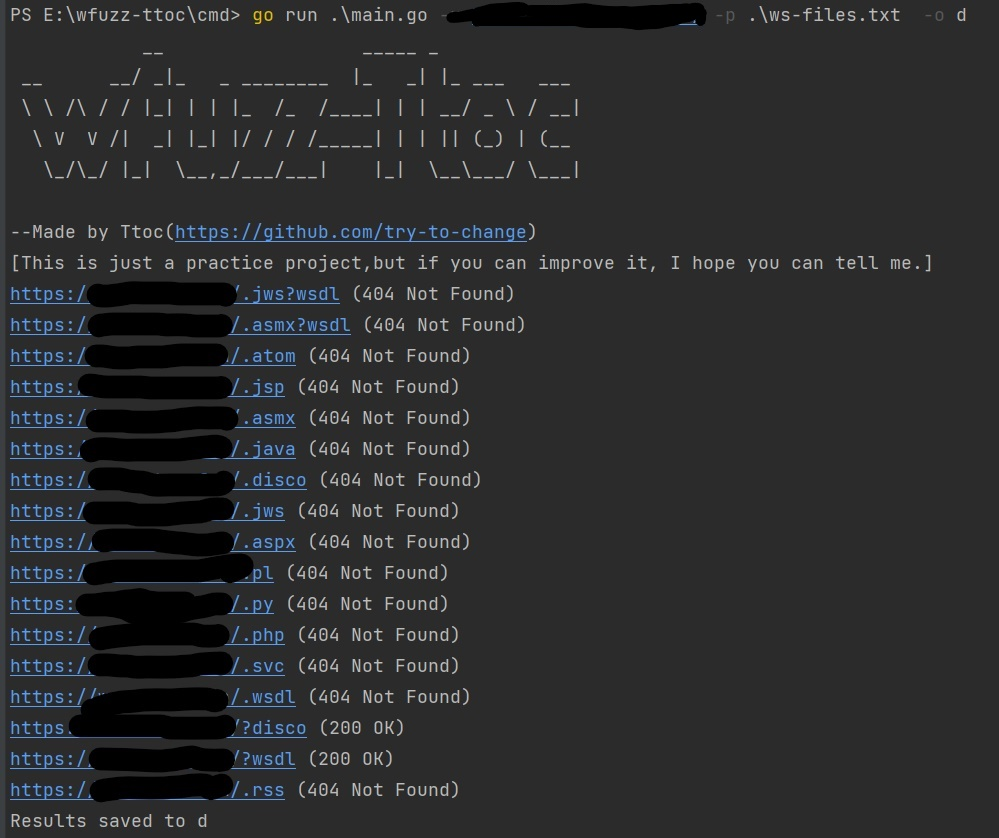

> This is just a practice project,but if you can improve it, I hope you can tell me.

```
cd cmd
go build . -o wfuzz
./wfuzz -u <url> -p <payload> [options]
```

该工具借鉴了wfuzz的一些原理与逻辑，以go语言实现(go菜鸟

### Main processes and functions

1. 定义命令行参数，使用flag包进行解析。
2. 使用http包发送请求，并使用goroutine和channel实现并发。
3. 在发送请求之前，根据传入的参数，使用strings包中的Replace函数替换FUZZ参数。
4. 根据不同的payload格式，使用bufio包进行读取和解析。
5. 使用for循环和range关键字实现迭代器。
6. 根据页面响应、状态码等信息，使用正则表达式或标准库中的http包中的Response结构体中的状态码等信息进行判断。
7. 将请求结果输出到标准输出或文件中，使用标准库中的io包即可。同时可以在输出时，添加更多的信息，如请求的URL、响应状态码等。
8. 使用log包记录程序运行日志，方便调试和错误处理
9. 实现统计请求次数、成功次数、失败次数等功能，方便对工具性能进行评估。

The tool draws lessons from some principles and logic of wfuzz and is implemented in go language (go rookie). 
The main writing process and functions are as follows. 

1. Define command-line parameters and parse using the flag package. 
2. Send requests using http packages and concurrency using goroutine and channel. 
3. 
   Before sending the request, replace the FUZZ parameter with the Replace function in the strings package based on the parameters passed in. 
4. 
   Use bufio packages for reading and parsing according to different payload formats. 
5. 
   Implement an iterator using the for loop and the range keyword. 
6. 
   According to the information such as page response and status code, the regular expression or the status code in the http structure in the Response package in the standard library is used to judge. 
7. Output the result of the request to standard output or file, using the io package in the standard library. 
   At the same time, you can add more information, such as the URL of the request, the response status code, and so on. 
8. 
   Use the log package to record the running log of the program to facilitate debugging and error handling. 
9. It is convenient to evaluate the performance of the tool by counting the number of requests, successes, failures and other functions


### Use case diagram







### Improve

对于wfuzz更深入功能并未进行书写

由于练手熟悉go开发，所以只大致实现了部分功能，其实我也觉得代码稍微有点臃肿，如果有建议和优化的思路，我将时刻准备学习你的建议

The more in-depth functions of wfuzz are not written.

As the practitioner is familiar with go development, so only roughly achieved part of the function, in fact, I also think the code is a little bloated, if there are suggestions and optimization ideas, I will always be ready to learn your suggestions


